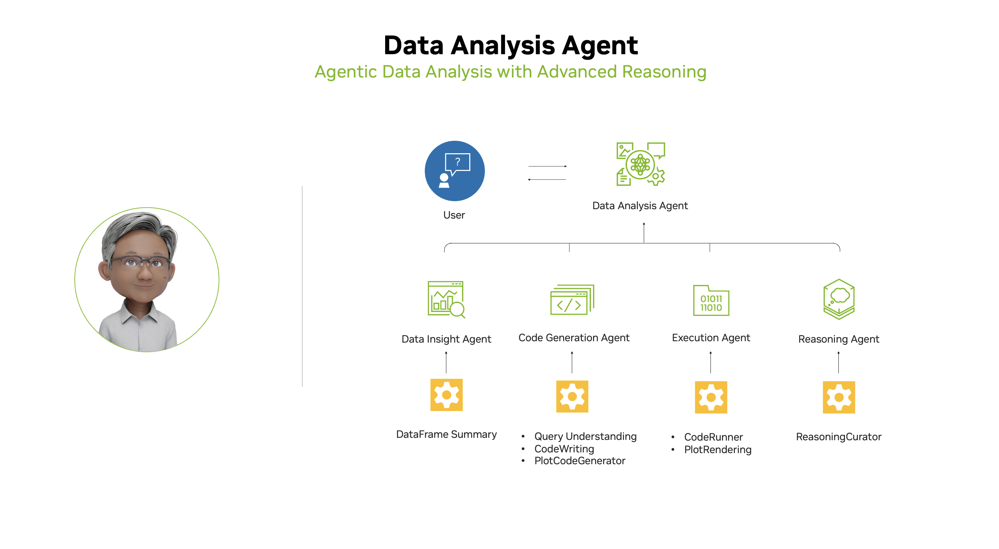

# Data Analysis Agent

An intelligent, next-generation data visualization platform powered by NVIDIA Llama-3.1-Nemotron-Ultra-253B-v1 that automatically understands your data and delivers professional-grade visualizations through natural language queries.

## Overview

This application revolutionizes the way users interact with their data by creating an agent-based experience:

1. **Intelligent File Understanding**: Upload CSV or Excel files and the agent automatically analyzes the structure and content
2. **Natural Language Interface**: Ask questions about your data in plain English without specifying visualization types
3. **Automated Visualization Selection**: The system intelligently determines the most appropriate visualization for your query
4. **Interactive, Professional Visualizations**: Get industry-standard, interactive charts and insights similar to Power BI or Tableau

## Key Features

- **Agentic Architecture**: Modular, intelligent components work together to understand data and queries
- **Advanced Visualization Library**: Leverages Plotly, Matplotlib, Altair, and other libraries for interactive, high-quality charts
- **Intelligent Data Processing**: Automatically handles data cleaning, transformation, and preparation
- **Multi-format Support**: Works with CSV and Excel files (.xlsx, .xls)
- **Smart Query Analysis**: Identifies intent, required fields, and visualization needs from natural language
- **Professional UI**: Dashboard-like experience with visualization gallery and insights
- **Transparent Reasoning**: Clear explanations of insights from each visualization



## Visualization Capabilities

The agent can automatically generate a wide range of visualizations:

- **Bar Charts**: Regular, grouped, and stacked bar charts
- **Line Charts**: Time series, trend lines, and multiple series
- **Pie/Donut Charts**: For composition and part-to-whole relationships
- **Scatter Plots**: For relationship and correlation analysis
- **Heatmaps**: For correlation matrices and categorical comparisons
- **Geographic Maps**: For location-based analysis with markers or choropleth
- **Tables**: For detailed data examination with formatting
- **Combination Charts**: Complex visualizations mixing multiple types

All visualizations are interactive, with tooltips, zoom, pan, and export capabilities.

## Requirements

- Python 3.10+
- Streamlit 1.32.0+
- NVIDIA API Key (see [Installation](#installation) section for setup instructions)
- Required Python packages:
  - pandas, numpy, matplotlib, plotly
  - scikit-learn, seaborn, altair
  - openpyxl, xlrd (for Excel support)
  - python-dotenv, openai
  - streamlit-extras, pydeck (for enhanced UI)

## Installation

1. Clone this repository:
   ```bash
   git clone https://github.com/your-username/data-analysis-agent.git
   cd data-analysis-agent
   ```

2. Install dependencies:
   ```bash
   pip install -r requirements.txt
   ```

3. Set up your NVIDIA API key:
   - Sign up or log in at [NVIDIA Build](https://build.nvidia.com/nvidia/llama-3_1-nemotron-ultra-253b-v1?integrate_nim=true&hosted_api=true&modal=integrate-nim)
   - Generate an API key
   - Create a `.env` file with your API key:
     ```
     NVIDIA_API_KEY=your_api_key_here
     ```

## Usage

1. Run the Streamlit app:
   ```bash
   streamlit run data_analysis_agent.py
   ```

2. Upload your data file (CSV or Excel)

3. Start asking questions about your data:
   - "Show me sales trends over time"
   - "What's the distribution of customers by region?"
   - "Visualize the relationship between price and quantity sold"
   - "Compare performance across different product categories"

4. Explore the visualization gallery to review all generated charts

## Example Queries

Here are some sample queries you can try:

- **Trend Analysis**: "How have monthly sales changed over the past year?"
- **Comparisons**: "Compare the average order value across different customer segments"
- **Distributions**: "Show me the distribution of transaction amounts"
- **Correlations**: "Is there a relationship between marketing spend and revenue?"
- **Geographic**: "Visualize the customer distribution by country"
- **Compositions**: "What's the breakdown of revenue by product category?"
- **Insights**: "What insights can you give me about the factors affecting customer churn?"

## How It Works

The application uses a sophisticated pipeline:

1. **Data Loading & Understanding**: Analyzes file structure, data types, and relationships
2. **Query Analysis**: Determines query intent, required fields, and visualization needs
3. **Data Processing**: Prepares data with appropriate cleaning and transformations
4. **Visualization Generation**: Creates the most appropriate visualization for the query
5. **Insight Generation**: Provides explanations and observations about the visualization

## Model Details

The Llama-3.1-Nemotron-Ultra-253B-v1 model used in this project has the following specifications:
- **Parameters**: 253B
- **Features**: Advanced reasoning capabilities
- **Use Cases**: Complex data analysis, multi-agent systems
- **Enterprise Ready**: Optimized for production deployment

## Acknowledgments

- [NVIDIA Llama-3.1-Nemotron-Ultra-253B-v1](https://build.nvidia.com/nvidia/llama-3_1-nemotron-ultra-253b-v1)
- [Streamlit](https://streamlit.io/)
- [Plotly](https://plotly.com/)
- [Pandas](https://pandas.pydata.org/)

## Contributing

Contributions are welcome! Please open an issue or submit a pull request.
